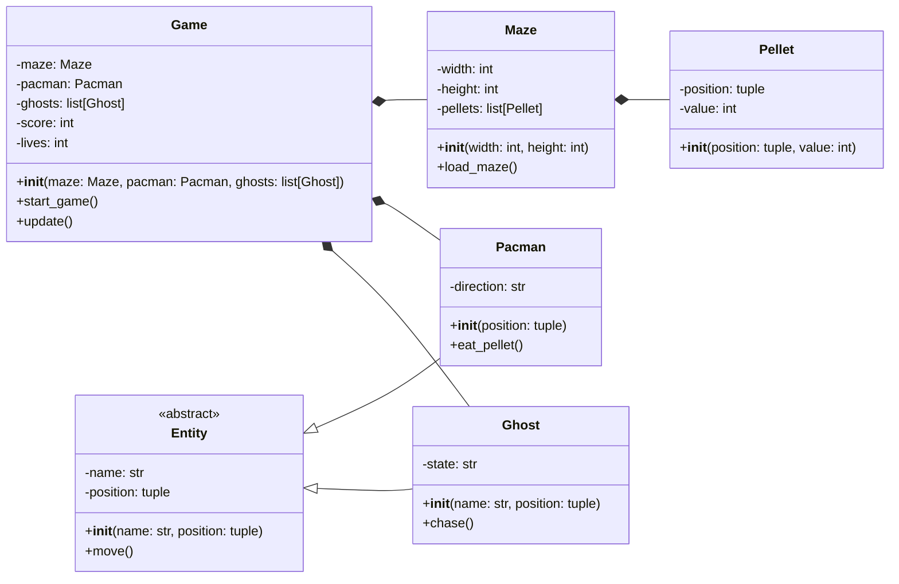

# **PROG1400 – Object-Oriented Programming**

# **Midterm Practice Exercise: Translating a UML Class Diagram into Python Classes**

---

# **1. Assignment Details**

| Field                | Information                                    |
| -------------------- | ---------------------------------------------- |
| **Course**           | PROG1400 – Object-Oriented Programming         |
| **Assignment Title** | Midterm Practice – UML Class Diagram to Python |
| **Assignment Type**  | Individual Practice Exercise                   |
| **Weight**           | Practice (Formative – preparation for midterm) |
| **Estimated Effort** | 1–2 hours                                      |
| **Submission**       | Brightspace (LMS)                              |
| **Due**              | Before Midterm (see Brightspace for date)      |

---

# **2. Overview**

One of the most important skills in object-oriented programming is the ability to **translate a design diagram into working code**.

In professional software development, engineers frequently receive **UML class diagrams** created during system design. Their task is to convert these diagrams into **programming language classes**.

This exercise gives you practice performing that translation.

You will be given a **Pac-Man UML class diagram written using Mermaid**. Your task is to **create the corresponding Python classes**.

This assignment focuses **only on class structure**, not gameplay logic.

---

# **3. Learning Objective**

By completing this exercise, you will practice:

* Reading a **UML class diagram**
* Identifying **classes, attributes, and methods**
* Writing **Python class definitions**
* Implementing **constructors (`__init__`)**
* Creating **class inheritance relationships**

This exercise mirrors the type of **diagram-to-code translation** you will perform on the **midterm exam**.

---

# **4. Instructions**

You are provided with the following **Pac-Man class diagram**.

Your task is to:

1. Create a Python file.
2. Translate each class in the diagram into a **Python class definition**.
3. Include:

   * all **attributes**
   * all **methods**
   * correct **inheritance relationships**
4. Constructors (`__init__`) must initialize the attributes shown in the diagram.

**Important**

You **do not need to implement the full logic** of the methods.

Each method may simply contain:

```python
pass
```

The purpose of this exercise is **correct class structure**, not functionality.

---

# **5. Pac-Man UML Class Diagram (Mermaid)**



---

# **6. Requirements**

Your Python code must:

* Create **six classes**

```
Game
Maze
Entity
Pacman
Ghost
Pellet
```

Your code must include:

* All **attributes shown in the diagram**
* All **methods shown in the diagram**
* Proper **inheritance**

  * `Pacman` inherits from `Entity`
  * `Ghost` inherits from `Entity`

Methods do **not** need full implementation.

Example:

```python
class Ghost(Entity):

    def chase(self):
        pass
```

---

# **7. Deliverables**

Submit **one Python file** containing all class definitions.

Example filename:

```
pacman_classes.py
```

Your file should include:

* all class definitions
* constructors
* attributes initialized
* method definitions

No gameplay logic is required.

---

# **8. Submission Instructions**

Submit your Python file to **Brightspace** under:

**Midterm Practice – UML to Python Classes**

Your instructor will review the structure of your classes and provide feedback before the midterm.

---

