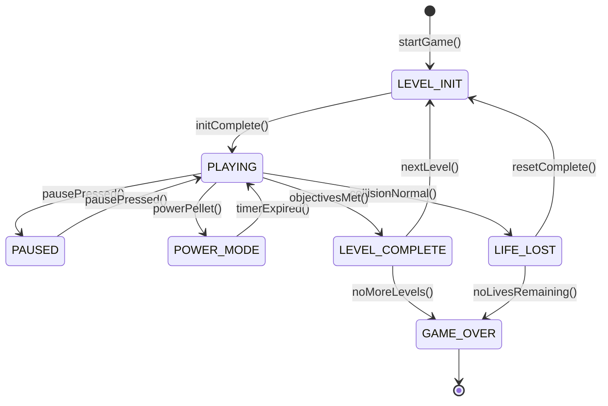

# 🧩 PROG1400 — Workshop 5

## From State Diagrams to Python Code

### *A Guided Learning Adventure in Object-Oriented Design*

---

## 1. Workshop Details

**Course:** PROG1400 – Object-Oriented Programming
**Week:** 5
**Workshop Title:** Mapping UML State Diagrams into Python Starter Code
**Workshop Type:** Guided Learning Workshop
**Estimated Time:** 2–3 hours
**Prerequisites:**

* Workshop 3 — UML Class Diagram
* Workshop 4 — Game States Document + UML Sequence Diagrams

**Tools Required:**

* Visual Studio Code
* Python 3
* VS Code Extension: **Mermaid Chart** (official)
* Your existing PROG1400 repository

**Primary Learning Outcome:**
**Outcome 4 — Develop an object-oriented solution utilizing software modelling design documentation**

---

## 2. Why This Workshop Matters (Read This First)

Up to now, you have been **designing** your game:

* You wrote **rules** (what is allowed)
* You identified **states** (modes of behaviour)
* You drew **UML diagrams** (structure and interaction)

At some point, every design must become **code**.

This workshop teaches you **how to cross that bridge safely**.

> ⚠️ Many beginners jump straight into coding and end up with:
>
> * giant `if/else` chains
> * duplicated logic
> * confusing bugs
> * no idea where code belongs

This workshop shows you the **professional way**:

> **State diagram → controlled Python code → clear behaviour**

---

## 3. Big Idea: Games Are State Machines

Before writing *any* code, understand this idea:

> A game behaves differently depending on its **state**.

Think about Pac-Man:

* When the game starts → the level loads
* When playing → movement and collisions happen
* When powered up → ghosts behave differently
* When a life is lost → everything resets
* When the game is over → nothing updates

These are **states**.

A **state machine** is simply a program structure that:

* knows the current state
* allows only valid transitions
* changes behaviour based on that state

---

## 4. What You Will Build Today

By the end of this workshop, you will have:

1. A **UML State Diagram** (design)
2. A **Python `Enum`** representing states
3. A **State Machine class**
4. One **method per transition**
5. A simple **update loop**
6. A **console simulation** proving it works

⚠️ You are **not** building a full game yet.
You are building the **control system** that will run the game later.

---

# 🧠 Part A — Understanding the Pac-Man Example (Concept First)

We will use **Pac-Man** as a reference because it is familiar.

You must **apply the same ideas to your own game**.

### Pac-Man Example States

| State          | What It Means             |
| -------------- | ------------------------- |
| LEVEL_INIT     | Load map, reset positions |
| PLAYING        | Normal gameplay           |
| PAUSED         | Game frozen               |
| POWER_MODE     | Ghosts frightened         |
| LIFE_LOST      | Player died               |
| LEVEL_COMPLETE | All pellets collected     |
| GAME_OVER      | No more lives             |

You should already have similar states written in your **Game States Word document**.

---

# 🧠 Part B — UML State Diagram (Design Before Code)

## Step B1 — Create the Diagram File

In your repository:

```
/docs/uml/
w#######-<game_name>-UML-State-01.mmd
```

---

## Step B2 — Pac-Man Reference State Diagram

This diagram shows **how states connect**.



### What this diagram is saying (in plain English)

* The game **starts** by initializing a level
* Once ready, it enters **PLAYING**
* From PLAYING:

  * the game can pause
  * power mode can start
  * collisions can cause life loss
  * objectives can end the level
* Some states return to PLAYING
* Some states end the game

This diagram is your **roadmap**.

---

## Step B3 — Adapt This to *Your* Game

You must now:

* rename states to match your game
* remove states you don’t need
* add states you *do* need

This diagram becomes the **source of truth**.

---

# 🧱 Part C — Turning States into Python (Slow and Careful)

Now we write code — but **only after design**.

---

## Step C1 — Create the Python File

In your repo:

```
/src/game_state_machine.py
```

---

## Step C2 — Create the State Enum

### Why an Enum?

An `Enum`:

* prevents spelling mistakes
* limits possible states
* makes code readable

```python
from enum import Enum, auto

class GameState(Enum):
    LEVEL_INIT = auto()
    PLAYING = auto()
    PAUSED = auto()
    POWER_MODE = auto()
    LIFE_LOST = auto()
    LEVEL_COMPLETE = auto()
    GAME_OVER = auto()
```

🧠 **Mental model:**
Each enum value = **one box in your UML state diagram**

---

## Step C3 — Create the State Machine Class

This object:

* remembers the current state
* controls transitions
* owns game-level state (lives, level)

```python
class GameStateMachine:
    def __init__(self):
        self.state = GameState.LEVEL_INIT
        self.lives = 3
```

🧠 **OOP idea:**
This class has **one responsibility** — control the game state.

---

## Step C4 — Centralize State Changes

```python
    def set_state(self, new_state):
        print(f"[STATE] {self.state.name} -> {new_state.name}")
        self.state = new_state
```

Why this matters:

* all state changes go through one place
* debugging becomes easy
* behaviour stays predictable

---

# 🔁 Part D — Mapping UML Transitions to Methods

This is the **most important learning moment**.

> **Every arrow in your UML diagram becomes a method.**

---

### Example: LEVEL_INIT → PLAYING

UML:

```
LEVEL_INIT --> PLAYING : initComplete()
```

Python:

```python
    def init_complete(self):
        if self.state == GameState.LEVEL_INIT:
            self.set_state(GameState.PLAYING)
```

---

### Example: Pause Toggle

```python
    def pause_pressed(self):
        if self.state == GameState.PLAYING:
            self.set_state(GameState.PAUSED)
        elif self.state == GameState.PAUSED:
            self.set_state(GameState.PLAYING)
```

🧠 **Key idea:**
Transitions are **guarded**.
Invalid transitions are ignored.

---

### Example: Losing a Life

```python
    def collision_normal(self):
        if self.state == GameState.PLAYING:
            self.lives -= 1
            self.set_state(GameState.LIFE_LOST)
```

🧠 **Notice:**
The collision does **not** decide the whole game — it triggers a **state change**.

---

# 🧭 Part E — The Update Loop (Where Beginners Usually Go Wrong)

Instead of spreading logic everywhere, we centralize it.

```python
    def update(self):
        if self.state == GameState.LEVEL_INIT:
            print("Initializing level...")
            self.init_complete()

        elif self.state == GameState.PLAYING:
            print("Playing...")

        elif self.state == GameState.PAUSED:
            print("Paused...")

        elif self.state == GameState.LIFE_LOST:
            print("Life lost...")
            self.set_state(GameState.LEVEL_INIT)

        elif self.state == GameState.GAME_OVER:
            print("Game over.")
```

🧠 **Why this is powerful:**

* behaviour changes automatically by state
* no giant `if` chains in Player or Enemy
* easy to extend later

---

# 🧪 Part F — Prove It Works (Console Simulation)

Add this at the bottom:

```python
if __name__ == "__main__":
    gsm = GameStateMachine()

    gsm.update()
    gsm.pause_pressed()
    gsm.update()
    gsm.collision_normal()
    gsm.update()
```

Run the file.

### What success looks like

You should see:

* state names printed
* transitions happening
* no crashes

---

# 🤖 Part G — Using Copilot the *Right* Way

Copilot is allowed — **thinking is required**.

Use it to:

* generate skeletons
* compare approaches
* save time on syntax

Do **not** use it to skip understanding.

### Good Copilot Prompt

```text
I have a UML state diagram for a game.
Generate Python starter code with:
- an Enum for states
- one method per transition
- a central update() loop
Keep it beginner-friendly.
```

Then compare with **your UML**.

---

# 📦 Deliverables

You must submit:

1. **UML State Diagram**

   * `.mmd` file

2. **Python Starter Code**

   * `game_state_machine.py`

3. **Screenshot**

   * Console output showing **at least 3 state transitions**

---

## ✅ What You Learned (Important)

If you understand this workshop, you now know:

* why games use state machines
* how UML diagrams map to code
* how to control behaviour cleanly
* where logic belongs in OOP
* how to avoid beginner traps

This is a **huge milestone**.

---
